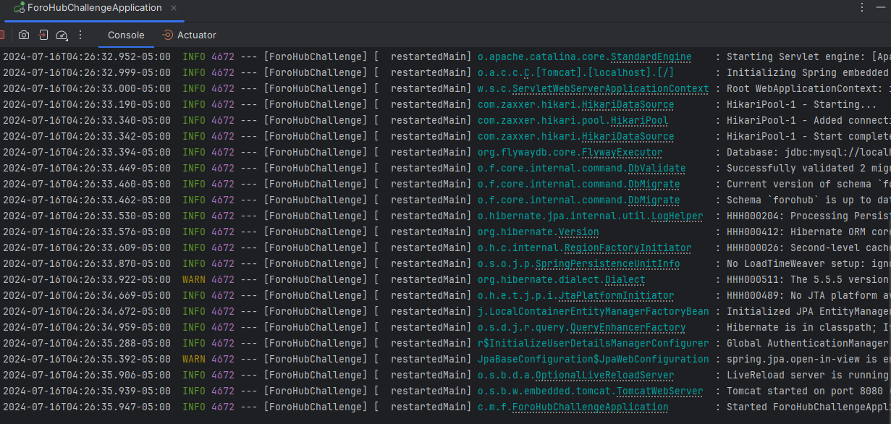

# ForoHub

## Descripción del proyecto

ForoHub es un Challenge propuesto por AluraLatam, es un espacio donde todos los participantes de una plataforma pueden plantear sus preguntas sobre determinados tópicos. Nuestra API se centrará específicamente en los tópicos, y permite a los usuarios: crear un nuevo topico, mostrar todos los topicos creados, mostrar un topico en específico, actualizar un topico y eliminar un topico.

## Demostración de funciones

1. **Api restringida**:
    - POST /login - Solo los usuarios autenticados pueden interactuar con la API. Para acceder el usuario debe enviar su (email, password). Todas las rutas de la API están protegidas, en cada solicitud deben enviar un token.

2. **Crear un nuevo topico**:
    - POST /topicos - Si el titulo y mensaje del topico ya existen en la base de datos no se creara el topico, caso contrario crea un nuevo topico. Para crear un nuevo topico el usario debe enviar (title, message, course)

3. **Listar todos los topicos**:
    - GET /topicos - Realiza una consulta y muestra todos los topicos registrados en la base de datos. La API retornara como respuesta por cada topico (id, title, message, creationDate, status, author, course)

4. **Listar topico por ID**:
    - GET /topicos/id - La API realiza una consulta por ID y retorna como respuesta (title, message, creationDate, status, author).

5. **Actualizar topico por ID**:
    - PUT /topicos/id - Actualiza topico por ID, valida si el title y message ya existen en la base de datos.

6. **Eliminar topico por ID**:
    - DELETE /topicos/id - Elimina el topico por ID.

Funcionalidades de ForoHub

## Tecnologías utilizadas

Las tecnologías utilizadas en el proyecto:

- Java
- Spring Web
- Spring Boot DevTools
- Spring Data JPA
- FlyWay Migration
- MySQL Driver
- Validation
- Spring Security
- JWT

## WebServer en Ejecucion
